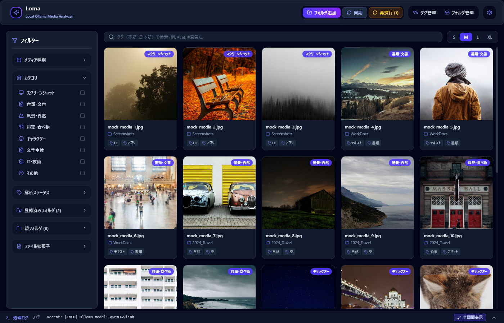
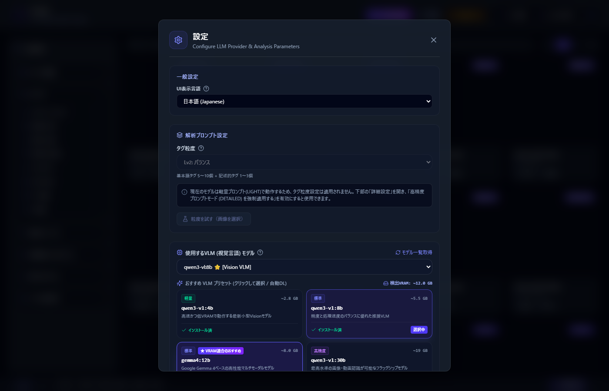
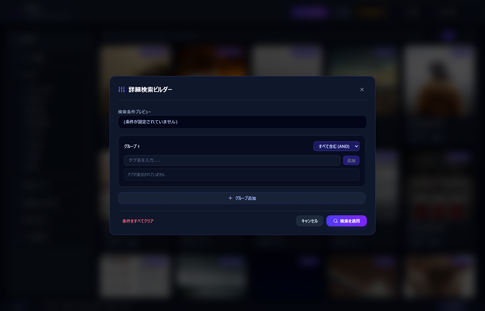

# Loma 使用方法ガイド

専門的な知識がない方でも迷わず使えるように、Loma の基本操作を手順ごとに説明します。

> このガイドは [README](../README.md) の「3. 使用方法」の詳細版です。Ollama や FFmpeg のインストール(事前準備)については README の「2. 動作環境のセットアップ」を先にご確認ください。

---

## ① 設定でモデルを選ぶ

Loma はメディアの解析に Ollama 上で動く AI モデル(VLM)を使います。まずは使うモデルを選びましょう。

1. アプリ右上の歯車アイコン(⚙️ 設定)をクリックして、設定画面を開きます。

   

2. 「使用するVLM(視覚言語)モデル」から、画像を解析するモデルを選びます。
   - すでに Ollama にモデルを入れている場合は、一覧から選ぶだけで完了です。
   - まだモデルを入れていない場合は、「おすすめ(VLM/Text LLM)プリセット」欄に表示されるモデルの `ダウンロード` ボタンを押すだけで、自動的に取得できます。難しいコマンド操作は不要です。
   - 大きいモデルほど付くタグは正確になりますが、そのぶん1枚あたりの解析時間は長くなります。迷ったら「標準」表示のモデルから試すのがおすすめです。

   

3. 動画も解析したい場合は、FFmpeg のインストールが必要です(README の「2.2 FFmpegのインストールとセットアップ」参照)。未インストールでも画像の解析は問題なく行えます。

---

## ② フォルダを追加してスキャンする

1. アプリ上部の **「フォルダ追加」** ボタンを押すと、OS標準のフォルダ選択画面が開くので、画像や動画が入っているフォルダを選択します。

   

2. フォルダを選ぶと、中のメディアが自動的にスキャンされます。まずサムネイル(縮小画像)が素早く作られ、そのあと順番に AI による解析が進みます。
3. 解析には時間がかかることがあります。画面下部の進捗表示で、残りの件数やおおよその完了時間を確認できます。

### あとからファイルを追加・整理した場合

- フォルダ内に新しい写真を追加したり、ファイルを移動・削除したりしたときは、上部の **「同期」** ボタンを押してください。
- 新規ファイルの検出、削除されたファイルの反映に加えて、**ファイルを移動・リネームした場合も自動で検知**され、再解析せずにパスだけが更新されます。

   

---

## ③ タグやカテゴリで絞り込んで見る

解析が終わったメディアは、以下の方法で探すことができます。

- **サイドバーの絞り込み**: 画面左側のサイドバーから、カテゴリ・メディアの種類(画像/動画)・解析状況(未解析/完了/失敗)ごとに表示を絞り込めます。
- **検索バー**: 画面上部の検索バーにタグ名(日本語・英語どちらでも可)を入力すると、そのタグが付いたメディアだけを直接検索できます。
- **詳細検索**: 検索バー付近の **「詳細検索」** をクリックすると、画面上のボタン操作だけで「すべて含む」「いずれか含む」「除外する」といった複雑な条件を組み立てて検索できます。コマンドやクエリ構文を覚える必要はありません。

   

   

---

## ④ その他の設定

設定画面(⚙️)では、以下の項目も変更できます。

- **UI表示言語**: 日本語 / English を切り替えられます。
- **タグ粒度**: タグの細かさを3段階から選べます。「雨に濡れた木」のような修飾語付きのタグを追加で付与するかどうかを切り替えられます(10B以上のモデル使用時)。

画面下部の **「詳細設定」** を開くと、さらに次の項目を変更できます。

- **LLMプロバイダー選択**: 通常は Ollama のままで問題ありません。
- **Ollama API エンドポイント URL**: 別のPCなどで動いている Ollama に接続したい場合に変更します(通常は変更不要です)。

---

## ⑤ 解析が遅い・やり直しが多いとき

1枚あたりに何分もかかったり、同じ画像の解析が何度もやり直されたりする場合は、次の順に試してください。

1. **タグ粒度を下げる**: 粒度が高いほどAIが考える量が増え、時間もメモリも多く必要になります。「Lv1: 分解重視」に下げると安定して速くなります。
2. **ひとつ下のモデルに変える**: 一番効果が大きい方法です。たとえば `qwen3-vl:30b` から `qwen3-vl:8b` へ変更すると、解析時間が大幅に短くなります。タグの細かさは多少落ちますが、多くの用途では十分な精度が出ます。VRAMが不足気味のPCでは特におすすめです。
3. **「送信画像の最大長辺」を小さくする**(詳細設定): 送る画像を小さくすると解析が軽くなります。ただし小さくしすぎると、写真に写っている文字の読み取り精度は落ちます。
4. **「コンテキスト長」を増やす**(詳細設定): 通常は `0`(自動)のままで問題ありません。自動調整でも解析が失敗し続ける場合のみ、手動で大きな値を指定します。

原因を詳しく調べたい場合は、詳細設定の **「LLM診断ログを出力する」** を ON にすると、解析1件ごとの処理内容がログに記録されます。

---

以上が Loma の基本的な使い方です。開発者向けのビルド手順については [README](../README.md) の「4. ビルドおよび開発手順」をご覧ください。
